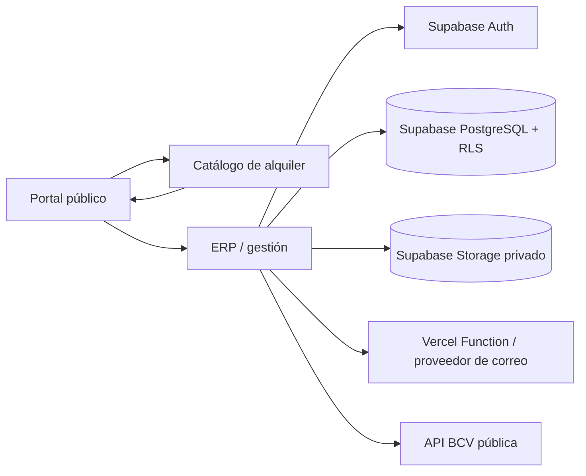

# Plan de implementación — CC Mario Sánchez / CCEMS

## Fuente de verdad

`C:\Users\Administrator\Desktop\Memoria\cc-mario-sanchez-comercial`

El levantamiento GIS permanece como entregable independiente. No se fusiona con el portal, alquiler ni ERP.

## Arquitectura objetivo

## Fases

### Fase 0 — Integración y seguridad inmediata

- Unificar enlaces y rutas canónicas.
- Corregir `/login` y `/onboarding`.
- Añadir headers de seguridad y política CSP compatible con los CDNs actuales.
- Evitar HTML dinámico sin escapar.
- Mantener demo explícitamente separada de producción.
- Eliminar duplicados SQL del árbol operativo.

### Fase 1 — Datos y autenticación reales

- Usar Supabase Auth para sesiones.
- Crear perfiles de usuario y relación usuario-inquilino.
- Implementar RLS por administrador e inquilino.
- Convertir Supabase en fuente de verdad; `localStorage` queda solo para preferencias y caché opcional.

### Fase 2 — Operación inmobiliaria

- CRUD remoto de unidades, inquilinos, contratos, facturas, pagos y gastos.
- Auditoría persistente.
- Comprobantes en Storage privado con URLs firmadas.
- Unificar catálogo público y unidades del ERP.

### Fase 3 — Alertas y correo

- Crear endpoint server-side de correo.
- Mantener proveedor intercambiable.
- Conectar avisos de cobro, pago recibido, mora, vencimiento y comprobante.
- Añadir reintentos, idempotencia y registro de entrega.

### Fase 4 — Plantilla multi-cliente

- Extraer branding, datos del inmueble, unidades, tarifas, monedas, textos y contactos a configuración.
- Permitir adaptar un nuevo cliente sin duplicar el código.

## Criterios de aceptación

- Ningún enlace operativo depende de una ruta relativa ambigua.
- `/`, `/alquiler`, `/gestion`, `/login` y `/onboarding` funcionan en producción.
- No existen contraseñas reales ni hashes de usuarios dentro del HTML público.
- Dos inquilinos autenticados no pueden ver ni modificar datos del otro.
- Un cambio remoto aparece en otro navegador/dispositivo.
- Los comprobantes no se guardan como Base64 en `localStorage`.
- Un correo de prueba llega sin exponer claves privadas.
- El catálogo y el ERP consumen la misma fuente de unidades.
